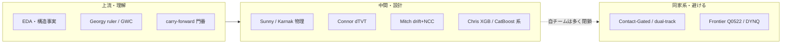

# 同家系以外の公開 NB 参考一覧（上流・中間・部分借り可）

> updated: 2026-07-26  
> 目的: 「Contact-Gated / dual-track / tip / Frontier VISUALS **以外**に、読む価値はあるか？」への回答  
> 前提: 票の多い公開の大半は同家系。**無いわけではない**が、LB で勝つ完成品は稀。多くは **上流・物差し・否定実験・概念** として効く  
> 方針の正: [`../comp-strategy.md`](../comp-strategy.md) · EDA: [`eda/strategy-from-eda.md`](eda/strategy-from-eda.md)  
> 同家系監視: evansussex / prvsiyan（Final 不採用）

## 1 行結論

**ある。** ただし「提出して即勝てる別スタック」ではなく、  
**(A) CV/ラベルの物差し (B) 物理・幾何の天井 (C) 特徴・目標の設計思想 (D) 行MLの否定** が主。  
自チームは既に B2/B3/Sunny/tabular を閉じているので、**丸ごと Final 化より部分借り（手順・式・監査）**が現実的。

---

## 層別マップ（どこを借りるか）

| 層 | 借りてよいもの | 借りないもの |
|---|---|---|
| **上流** | 評価区間定義 · 6tops=1面 · field-CV · oracle ladder · CF 門番 | 手元 `test/` チューニング |
| **中間** | drift 目標の考え方 · LOO 紀律 · PF=不確実性ゲートの叙述 | 素朴 heel affine · U=T+Z 持ち越し |
| **下流提出** | （同家系以外の強い公開完成品はほぼ無し） | Frontier 定数パッチ · tip クローン |

---

## 推奨リスト（同家系外 · 部分借り可）

### S — 必読（LB 直結でなく「脳の型」）

| slug | 借りる部分 | 自チーム状態 | メモ |
|---|---|---|---|
| **Georgy** `fork-the-ruler-not-the-model` | oracle ladder · leave-field-out · 「モデルを fork するな」 | 型は wave0-ruler 系で実装済 | **上流の監査**。提出コードではない |
| **Georgy** `measure-your-noise-floor-before-believing-a-lever` | 無編集再提出 **σ≈0.03** · lever 判定 | Trust CV 方針と整合 | **2026-07-29 必読** · [分析](georgy-noise-floor-lever-Ver.md) |
| **Georgy** `what-is-the-precision-of-a-manual-interpretation` | 人間解釈の分散 · median | 哲学のみ | Final 多様化の根拠。**LBは上がらない**と明記 |
| **n0** beginners 7 visuals / visual-eda | PNG・評価区間・train/test 重なり | EDA 済 | オンボーディング |
| **souldrive** trilogy（±15ft · Eagle Ford · TVT identity） | 二峰中点 · field-CV · U禁止 | strategy-from-eda 済 | **構造事実**（仮説ではない） |
| **Connor** `dz-dtvt-eda` | `dTVT≈−dZ+drift` · LOO · 幾何天井〜10ft | CHK-112 absorbed | **中間の天井証明**。提出不可 |

### A — 別経路の設計参考（完成品の再提出は非推奨）

| slug | 借りる部分 | 自チーム状態 | メモ |
|---|---|---|---|
| **Sunny** `rogii-wellbore-tvt-physical-model` | 物理 TVT + PF · GR補間 · 非tabular | **F004** SUB-1 悪化で Final 除外 | **中間の式・パイプライン叙述**は今も参考。再提出禁止 |
| **Karnak** `physics-informed-baseline` | PF×GBM の初期形 | 旧世代 | Sunny の祖先理解 |
| **Mitch** `drift-targeting-ncc-…` | **drift を目標** · multi-scale NCC | **F007/F008/F011** 閉鎖 | **上流の目標設計**だけ残る。offline 学習 NB 未同梱 |
| **Chris** `eda-starter` / `xgb-starter-cv-15` | GroupKFold · 行寄り ML の天井 | 否定実験の証拠 | CV~15 ≫ tip。**行ML Final 禁止**の根拠 |
| **n0** `honest-carry-forward-…` | CF ≫ 軌道 HGB | CHK-010/012 門番と整合 | **上流ベースライン** |
| **romanrozen** `catboost-baseline` | residual + GroupKFold 学習 | CHK-070 **F010** | 学習ループの型は参考 · 枠2としては失敗済 |
| **pavloivanin** / **sadamtorres** LGBM 系 | 行・井 tabular 学習 | 071 等 NO-GO | 天井確認用 |

### B — 部分だけ・注意深く

| slug | 借りる部分 | 注意 |
|---|---|---|
| **FOYSAL** Working Note / experimental | guarded contact · 失敗開示 | tip 近縁コードあり。**悪化ログ**を読む価値 |
| **Pilkwang** WN / target-free EDA | heel/整合の**文章** | コードは dual-track 近縁 → 概念のみ |
| **aiwody** `physical-model-less-overfitting-noise` | 物理系のノイズ抑制叙述 | Sunny フォーク寄り。未深掘り · 必要なら後で |
| **kojimar** Physical PF + artifact stack | 物理×artifact **ハイブリッド** | tip 家系への寄せ。多様性は弱い |
| **parthenos** DWT-based（票最多級） | 早期 DTW/DWT 路線 | LB 帯は旧（~9）。文献の無制約 DTW 警告とセット |
| **RickPack** R LightGBM feature importance | 特徴の見方（上流） | 本命経路ではない |

### 明示的に「同家系」→ ここでは数えない

Contact-Gated · dual-track · luck tip · ultimate-pf · pfcfg · MHA/det · Frontier Q0522/DYNQ0130/**DYNQ0196** · **Final Hierarch** · **Contact+U Restore** · **daniil「Solution on 6.390」** · **robust-ensemble-v3 / best-score-roggi / gold-calibra fork（koolbox同型）** · geoanchor（エンジン同系）· A016 · タイトルだけ「beam-search / another approach / 6.391」の Q0522 クローン

---

## 「一部だけ参考」にする具体例

| 欲しいもの | 見る NB | 抜き出す単位 |
|---|---|---|
| CV が信用できるか | Georgy ruler · 727570 · 728477 | leave-out 手順 · seed バンド測定 |
| なぜ行 ML がダメか | Chris XGB · n0 CF · beginners | CF vs HGB の表 |
| 幾何だけでどこまでか | Connor | LOO 梯子 · kappa |
| GR 照合の不確実性 | Sunny / FOYSAL / tip 叙述 | PF を point estimate にしない |
| drift を何に置くか | Mitch writeup | 目標定義（実装は自前で失敗済） |
| 二峰を尖らせない | souldrive 15ft · Georgy GWC | 中点 / median |

---

## 自チームへの含意（2026-07-26）

| 質問 | 答え |
|---|---|
| 同家系以外の**提出用**公開最右はあるか？ | **事実上ほぼ無い**（公開最右は Frontier 同家系） |
| 読む価値のある非同家系はあるか？ | **ある**（上表 S/A） |
| 今から Active CHK を増やすか？ | **原則増やさない**（物理 F004 · NCC F011 · tabular F010 済）。新機構は承認 + `comp-strategy` 更新が必要 |
| 一番コスパの良い再読 | Georgy ruler（監査）· Connor（天井）· Mitch（目標の言葉だけ）· Sunny（式の理解・再提出なし） |

---

## 関連ファイル

| ファイル | 役割 |
|---|---|
| [README-public-useful.md](README-public-useful.md) | 公開有用 19本索引 |
| [eda/README.md](eda/README.md) | EDA 12本 |
| [public-physical-alt-Ver.md](public-physical-alt-Ver.md) | Sunny / Mitch 等の旧要約 |
| [public-validation-education-Ver.md](public-validation-education-Ver.md) | Georgy / n0 / Chris |
| [dz-dtvt-eda-Ver-latest.md](dz-dtvt-eda-Ver-latest.md) | Connor |
| [`../../exp/exp-intel.md`](../../exp/exp-intel.md) | 外部知見 SSOT |
