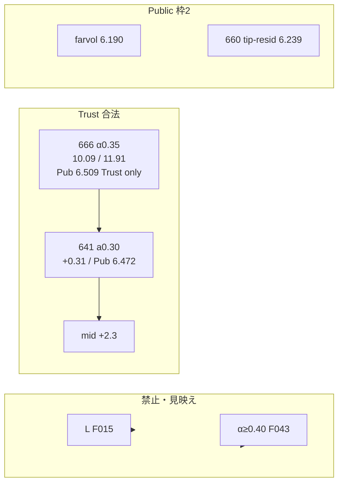

# 工程内比較グラフ — 実験恒常 SSOT

> **種別:** 実験グラフ（常設）  
> **updated:** 2026-08-06（**コンペ終了 · Final2 LOCK · L1 dual 梯子最終**）  
> **Live Canvas:** [`within-stage-comparisons.canvas.tsx`](<cursor-workspace>/canvases/within-stage-comparisons.canvas.tsx)（**パネル 0–12**）  
> **数値の正:** hyperparameter-table · catalog-faces-041247 · Public ops-lb · [**Final2 Ops**](latest/final2-ops-20260805.md) · [**laws 最終**](latest/l-improvement-laws-2026-08-05.md) · [781 dual](work/out-t3-cpu-harvest/l-dual-CHK-781-kaggle-v1/report.md) · [784](latest/ops-chk784-dual-nogo-2026-08-05.md) · [exp-index](exp-index.md)  
> **チェックリスト:** Active 空 · 結果は [`checklist-archive.md`](checklist-archive.md)  

---

## 自チーム Public 基準線（★ 混同禁止）

| ラベル | 提出 / 面 | Public RMSE | 役割 |
|---|---|---:|---|
| **Public 1位（自Best）** | **farvol** tip×portable **0.95/0.05**（CHK-420 系） | **6.190** | **枠2固定 · Public 軸の唯一の基準線** |
| tip（S0 土台） | SUB-14 / tip E2E（LIK_TEMP=0.15） | **6.269** | S0 土台 · **1位ではない**（Δ **+0.079**） |
| 618c / 558b / **660** / 541 | tip⊕ / tip residual | 6.231 / 6.238 / **6.239** / 6.256 | 枠2NO · tip⊕群 · 再提出禁止 |
| **711 tip⊕ g0.10** | tip⊕ w050 mid | **6.359** | map OK · **Public NO · 枠2NO**（Δ **+0.169**） |
| 641 residual | mid+α0.30 L | **6.472** | Public NO-GO（Δ **+0.282**） |
| **666 residual** | mid+α0.35 L | **6.509** | **Public NO-GO** · Trust only（Δ **+0.319**） |
| **710ssot residual** | s3zero α0.35 | **6.613** | **Public NO-GO** · 666より悪（Δ **+0.423**） |
| **702 w050+resid** | mid w0.50 + α0.35 | **7.394** | **Public 壊滅**（Δ **+1.204**） |

**答え:** tip **= 6.269**。**6.190 は tip ではなく farvol（枠2）**。

### Public 多様性（Δ = Public − 6.190 · 正=★1位より悪い）

> Public 尺だけの比較。**σ≈0.03 帯**（≲0.08）は差がノイズ級になりやすい → 多様性の主張は **≳0.08** で読む。  
> Canvas **パネル 0** が本節。  
> residual 梯子 **641 ≺ 666 ≺ 710 ≺ 702** は別クラスタ（Trust には影響しない）。

| rank | 提出面 | Public | **Δ vs farvol** | σ帯 | 読み |
|---:|---|---:|---:|---|---|
| ★1 | **farvol** | **6.190** | **0** | — | **基準 · 枠2** |
| 2 | 618c | 6.231 | **+0.041** | ≲σ帯 | 近い · 枠2NO |
| 3 | 558b | 6.238 | **+0.048** | ≲σ帯 | 近い · 枠2NO |
| 4 | **660 tip-resid** | **6.239** | **+0.049** | ≲σ帯 | tip residual · 枠2NO |
| 5 | 515 row | 6.249 | **+0.059** | ≲σ帯 | tip 近傍 |
| 6 | 541 | 6.256 | **+0.066** | ≲σ帯 | 近い · 枠2NO |
| 7 | tip S0 | 6.269 | **+0.079** | ≒σ境 | **土台 · ≠1位** |
| 8 | 579 row | 6.277 | **+0.087** | ≳σ | 軽い外れ |
| 9 | 514 H-D | 6.335 | **+0.145** | 多様 | Public NO |
| 10 | **711 tip⊕ g0.10** | **6.359** | **+0.169** | 多様 | tip-close map · **Public NO** |
| 11 | **641 residual** | **6.472** | **+0.282** | **大** | mid residual 外れ |
| 12 | **666 residual** | **6.509** | **+0.319** | **大** | Trust頭 · Public NO-GO |
| 13 | **710ssot residual** | **6.613** | **+0.423** | **大** | 666より悪 · re-submit ban |
| 14 | **702 w050+resid** | **7.394** | **+1.204** | **壊滅** | tipdist 4.2 ≡ Public |

```text
Δ vs ★Public1 farvol (6.190)  ——  0 が重なっているほど「同じ群れ」
  ★0.00 farvol
  ·0.04 618c        ┐
  ·0.05 558b / 660  │ σ帯（多様性ほぼ薄い）
  ·0.07 541         │
  ·0.08 tip         ┘
  ·0.09 579
  ·0.15 514
  ·0.17 711 tip⊕      ← tip 近傍 map 成功だが Public 勝ちなし
  ·0.28 641 residual
  ·0.32 666 residual
  ·0.42 710ssot       ← residual Public 梯子（Trust T2 僅勝≠LB）
  ·1.20 702 w050+r    ← 壊滅（図外スケール）
```

**読み:** tip⊕ と **tip residual 660** は farvol から **+0.04〜0.08** で「ほぼ同クラスター」。**711** は tip-close map でも枠2未達。  
**mid residual（641/666/710/702）は別クラスタで Public 失敗**（α↑・mid 太さ↑ で悪化）。枠2 は farvol 固定。Trust 枠1 は 666 を Public で殺さない。

### なぜパネル 1–6（Trust T3）に Public1 線が無いか

Trust pool≈**10–17** と Public≈**6.2** は **単位・集合が違う**。同じ図に 6.190 の縦線を引くと誤読になる。  
★Public1 は **パネル 0 / 7**（と先頭 Stat）だけが正。

---

## 見方

1. 同じ工程の候補同士だけ比べる  
2. **Trust / Pack / Public / tipdist は別物差し**（棒を横断して「Best」にしない）  
3. Public 多様性は **Δ vs 6.190** で読む（パネル 0）  
4. Trust GO = **pool ∧ mean_worst ∧ max_band**（747）  
5. 診断面（L 生 · α≥0.40）は F015 / F043  
6. 更新フレーズ: 「工程内比較グラフを更新して」

### Canvas パネル

| # | 目的 |
|---:|---|
| **0** | **★Public1 多様性 Δ vs farvol 6.190** |
| 1–2 | Trust 合法帯 dual · Δvs666（★Public1 線なし＝尺違い） |
| 3–4 | band · α掃引 + tipdist |
| 5–6 | 家系 · Kaggle 3 本 seed |
| 7 | Public 絶対値梯子 + ★1 参照線 |
| 8 | tipdist E2E（farvol 0.078 含む） |
| 9 | S0 Pack |
| 10 | 運用結論 |
| 11 | CPU P0/P1 + L1 harvest |
| **12** | **Final2 scoreboard + ペア diversity（LOCK）** |

---

## faces T3 catalog（SSOT residual · `20260804-041247`）

> wells **80** · seeds **42/123/2026** · soft=True · elapsed ~22s  
> 出典: [`catalog-faces-041247/report.md`](work/out-t3-cpu-harvest/catalog-faces-041247/report.md)  
> prior 114917 比: 666 pool **+0.096** · 順位頭 **SAME**（750）  
> **≠ all773 tip フル尺**（下節）— mid 幾何・物差しが別

### all773 tip フル尺（`20260804-115307` · Trust ABC + グループ）

> wells **773** · rows **3,783,989** · 提出禁止 · [ABC](latest/chk-final-t2-all773-cv-2026-08-05.md) · **[工程×群](latest/all773-stage-well-group-2026-08-05.md)**

| policy | pooled | hard20 mean | frac mid | 読み |
|---|---:|---:|---:|---|
| **A tip** | **10.8388** | **26.8294** | 0 | **フル人口 tip 床** · 非hard mean **≈8.0** |
| **B tip⊕row** | **10.8307** | 26.8210 | 0.0249 | winner · Δ−0.008 のみ |
| C agree∧row | 10.8307 | 26.8210 | 0.0249 | **≡B**（agree 無効） |
| D agree-only | 10.8351 | 26.8210 | 1.0 | mid≈tip（tipdist **0.20**） |

| グループ / 帯 | 事実（773） |
|---|---|
| hard20 | 2.6% 井 · mean tip **26.83** · **SSE ≈20%** · tipdist mid **≈0.01** |
| 非 hard | mean tip **8.02** · その内 Q4e mean **≈15.6**（半 hard） |
| SSE 累積 | top20 **≈29%** · top50 **≈46%** · top100 **≈62%** |
| mid vs tip (y) | **win25 / hurt21 / タイ727** · ≠ T2 residual win77/hurt3 |

**工程への載荷:** S0 tip フル基準 = 本表 · **S9 residual Trust 頭 = 下記 666 / 041247 のみ** · all773 mid で residual 読み替え禁止。

| rank | graph | pooled | mean_worst | max_band | 判断 |
|---:|---|---:|---:|---:|---|
| 1 | S1 learned | 6.923 | 8.92 | 4.73 | **F015 禁止** |
| 2–5 | residual α0.80…0.40 | 7.68–9.79 | 9.47–11.53 | 4.0–4.6 | tipdist↑ · **F043/禁止寄** |
| 6 | 710 a035 s3zero | **10.032** | 11.89 | 4.17 | 数値僅勝 · test FIXED3 空 · Final 根拠にしない |
| **7** | **666 α0.35** | **10.094** | **11.905** | **4.144** | **Trust 本命 · Public 6.509 NO · Trust only** |
| 8–10 | 668 +soft β | 10.10–10.29 | 12.12–12.22 | 4.5–4.9 | map · tipdist↑ |
| 11 | 641 α0.30 | 10.401 | 12.28 | 4.28 | **Public 6.472 NO-GO** |
| 17 | mid | 12.344 | 14.62 | 5.16 | 材料 · 生 FINAL 禁止 |
| 18 | 620 soft inject | 12.907 | 15.39 | 7.21 | **閉鎖** |
| 19–21 | 735 tip⊕666 | 14.5–15.9 | 17.1–18.8 | 6.1–6.7 | Trust 負け |
| 22–24 | 711 tip⊕mid | 16.1–16.8 | 18.9–19.7 | 6.8–7.1 | tip-close map only |
| 25 | S0 tip | 17.030 | 20.02 | 7.23 | 土台 |

### Δ vs 666 α0.35（正=悪化 · 041247）

| face | Δpool | Δworst | 判定 |
|---|---:|---:|---|
| 710 s3zero | **−0.063** | **−0.018** | 僅勝 · Final 不採用 |
| 668 β0.20 | +0.009 | +0.22 | 微差 · band↑ |
| 668 β0.05 | +0.20 | +0.32 | map |
| **641 α0.30** | **+0.31** | **+0.38** | Public 閉鎖 |
| mid | +2.25 | +2.71 | 床 |
| 620 | +2.81 | +3.48 | NOGO |
| 735 λ0.35 | +4.39 | +5.20 | Trust 負け |
| 711 g0.10 | +6.45 | +7.56 | Trust 負け |
| tip | +6.94 | +8.11 | 土台 |
| L raw | −3.17 | −2.98 | F015 見映え |



---

## 工程内 Best（2026-08-06 · 終了）

| 工程 | 物差し | 工程内 Best | 穴 / 次 |
|---|---|---|---|
| **S0-T hard20** | Trust hard20 | T0.15 ≈ **29.9** | 凍結 |
| **S0-T all773** | full allowlist A/B/C | tip pool **10.839** · hard **26.829** | tip⊕ NOGO · [all773](latest/chk-final-t2-all773-cv-2026-08-05.md) |
| **S0-P** | Pack | 495 ≈ **17.1** | 生 FINAL 禁止 |
| **S0→Trust 載荷** | hard20 | 618c tip⊕soft ≈ **19.5** | Soft FINAL 禁止 |
| **S9 mid** | T2 | **697 w0.50 ≈10.94** | 材料 · 生 mid 禁止 · **all773 mid≈tip で別** |
| **S9 residual Trust** | T3-B + tipdist | **666 10.09 / 11.91 / tipdist 1.985** | **Public 6.509 · Trust only** · **新 L 未採用** |
| **S1 L** | L1 dual hard Δpool | **781 +0.44** ≺ 688 +0.52 ≺ 804 +0.74 ≺ 802 +1.79 ≺ 782 +3.81 ≺ 761 +4.01 ≺ **784 +6.27** · **全 NOGO** · F044+F045 | [laws](latest/l-improvement-laws-2026-08-05.md) · 777 incomplete |
| **S9 tipdist** | E2E | 666 **1.985** · 660 **1.923** · farvol **0.078** · 711 **0.327** · 702 **4.223** | 枠1×枠2 AB **1.950** · softβ/ridge 閉 |
| **S9 Public** | LB · **Δvs farvol** | **★farvol 6.190** · 660 **+0.049** · 711 **+0.169** · 666 **+0.319** · 710 **+0.423** · 702 **+1.204** | パネル0 · residual 梯子 |
| **Final2 配置** | レーン別 · pair | **枠1=666 · 枠2=farvol · OK_diverse** | [final2-ops](latest/final2-ops-20260805.md) · パネル **12** · 差替不要 |

---

## T2 / T3-B 梯子（pooled · 041247）

| 段 | pooled | mean_worst | Δworst | 状態 |
|---|---:|---:|---:|---|
| tip | 17.030 | 20.02 | +8.11 | 土台 |
| 620 | 12.907 | 15.39 | +3.48 | 閉鎖 |
| mid | 12.344 | 14.62 | +2.71 | 生 FINAL 禁止 |
| 641 α0.30 | 10.401 | 12.28 | +0.38 | Public NO-GO |
| 668 β0.05 | 10.293 | 12.22 | +0.32 | map |
| **666 α0.35** | **10.094** | **11.91** | **0** | **本命 · Public NO · Trust only** |
| 710 s3 | 10.032 | 11.89 | −0.02 | Final 不採用 |
| α0.50 | 9.211 | 10.91 | −0.99 | F043 禁止寄 |
| L | 6.923 | 8.92 | −2.98 | F015 禁止 |
| 697 mid eq* | 10.94* | — | — | *別 eq-well T2 · 材料 |

\* 697 eq-well T2 は faces catalog の mid 行と物差しが少し違う（工程材料表）。

---

## TEST tipdist（E2E · 別物差し）

| face | tipdist | Public | メモ |
|---|---:|---:|---|
| **farvol ★枠2** | **0.078** | **6.190** | Final2 Ops CSV · 薄 blend |
| 541 | 0.278 | 6.256 | 枠2NO |
| 711 g0.10 | 0.327 | **6.359** | map OK · **Public NO · 枠2NO** |
| 558b | 0.382 | 6.238 | 枠2NO |
| 641 α0.30 | 1.743 | **6.472** | Public NO-GO · 666同家系 |
| **660** | **1.923** | **6.239** | tip residual · 枠2NO |
| **666 α0.35 ★枠1** | **1.985** | **6.509** | **Trust 本命 · Public NO-GO** |
| 710ssot | ≈2.017 | **6.613** | T2 僅勝 · Public 悪化 · ban |
| 668 β0.05 | 2.552 | — | 禁止 |
| 697 mid | 3.298 | — | 生 mid 禁止 |
| 702 w050res | 4.223 | **7.394** | **Public 壊滅** · tipdist≡LB |
| 618c | 11.933 | 6.231 | Soft 系 · 再提出禁止 |
| tip（S0） | 0 | **6.269** | **≠1位** · 土台 |

---

## Public 梯子（絶対値 · 多様性は上節 Δ）

| rank | ID | Public | **Δ vs 6.190** | 枠 |
|---:|---|---:|---:|---|
| ★1 | **farvol** | **6.190** | **0** | **枠2 固定** |
| 2 | 618c | 6.231 | +0.041 | 枠2NO · 再提出禁止 |
| 3 | 558b | 6.238 | +0.048 | 枠2NO |
| 4 | **660 tip-resid** | **6.239** | +0.049 | 枠2NO · diversify 済 |
| 5 | 541 | 6.256 | +0.066 | 枠2NO |
| 7 | tip（S0 土台 · **≠Public1**） | 6.269 | +0.079 | 土台尺 |
| 10 | **711 tip⊕** | **6.359** | **+0.169** | Public NO · map only |
| 11 | 641 residual | 6.472 | **+0.282** | Public NO-GO |
| 12 | **666 residual** | **6.509** | **+0.319** | Public NO-GO · Trust only |
| 13 | **710ssot** | **6.613** | **+0.423** | Public NO-GO · ban |
| 14 | **702 w050+r** | **7.394** | **+1.204** | Public 壊滅 · ban |
---

## Final2 Ops — scoreboard + pair diversity（2026-08-05 · LOCK）

> SSOT 詳細: [`latest/final2-ops-20260805.md`](latest/final2-ops-20260805.md) · harvest [`work/final2-ops-20260805/kaggle-harvest/`](work/final2-ops-20260805/kaggle-harvest/)  
> Canvas **パネル 12** · **提出・自動差替なし** · 学習 dual ではない

| candidate | lane | Trust pool | worst3 | tipdist vs tip | Public | Final 仮 |
|---|---|---:|---:|---:|---:|---|
| **666** | Trust | **10.094** | **11.905** | 1.985 | 6.509 | **★枠1** |
| **farvol** | Public | — | — | **0.078** | **6.190** | **★枠2** |
| 660 | Public-diag | 11.17 | — | 1.923 | 6.239 | 枠外 |
| 641 | Trust | 10.40 | 12.28 | 1.743 | 6.472 | 枠外 · Trust2nd |
| tip | base | — | — | 0 | 6.269 | 土台 |

### 枠内順位（横断しない）

| レーン | 順位（良い順） |
|---|---|
| **Trust** pool | **666 ≺ 641 ≺ 660** |
| **Public** | **farvol ≺ 660 ≺ tip ≺ 641 ≺ 666** |

### ペア diversity（提出 CSV · tipdist_AB）

| A | B | tipdist_AB | same_family | 判定 |
|---|---|---:|---|---|
| **666** | **farvol** | **1.950** | False | **枠1×枠2 OK_diverse** |
| 666 | 641 | 0.375 | **True** | **2本載せ禁止** |
| farvol | tip | 0.078 | False | 薄 blend 近傍 |
| 660 | farvol | 1.880 | False | diversify 可だが Public 負け |

```text
tipdist_AB（提出同士）
  0.08  farvol×tip
  0.38  666×641     ← 同家系（mid residual）
  1.46–1.70  641 系 × 他
  1.88  660×farvol
  1.95  ★666×farvol 枠
  1.99  666×tip
```

---

## Trust residual · L1 dual ladder（最終 · 2026-08-06）

> 数値 SSOT: [laws](latest/l-improvement-laws-2026-08-05.md) · [781](work/out-t3-cpu-harvest/l-dual-CHK-781-kaggle-v1/report.md) · [784](latest/ops-chk784-dual-nogo-2026-08-05.md) · [802](latest/ops-chk802-dual-nogo-2026-08-05.md) · [804](latest/ops-l1-chk804-colab-dual-2026-08-05.md) · Canvas **パネル 11**  
> **Public 尺度ではない**（Trust residual only · 提出なし）

| 事実 | 値 / 読み |
|---|---|
| SSOT residual | pool **10.094** · worst3 **11.905** · faces **041247** · α**0.35** |
| **781 residual-path** | hard Δ**+0.44** · hybrid **+0.19** · d\|L−mid\| **−0.97** · **NOGO · F046 · 最良失敗** |
| **688 baseline** | hard Δ**+0.52** · hybrid **+0.23** · **NOGO** |
| **804 known×Q4** | hard Δ**+0.74** · d\|L−mid\| **−1.43** · **NOGO · F044** |
| **802 MD-Q4 行** | hard Δ**+1.79** · d\|L−mid\| **−4.24** · **NOGO · E2E ABORT** |
| **782 resid-drag** | hard Δ**+3.81** · d\|L−mid\| **−7.93** · **NOGO** |
| **761 fold-driver** | hard Δ**+4.01** · **NOGO 最悪 weight** |
| **784 Huber** | hard Δ**+6.27** · d\|L−mid\| **−4.06** · **NOGO · F045** |
| **777 reg↑** | dual **未** · 締切停止 |
| Final Trust 面 | **旧 666**（新 L を上げず） |
| Final Public 面 | **farvol 6.190** |

## 確定読み（2026-08-06 終了）

1. T3-B residual SSOT は **041247**。合法 Trust 頭は **666 α0.35**（新 L dual GO なし）。  
2. **all773:** tip pool **10.84** · tip⊕ **天井**。  
3. **mid residual Public 梯子 641≺666≺710≺702** → F043。  
4. **Final2 LOCK:** **枠1=666 · 枠2=farvol**。  
5. **L weight F044** · **Huber F045** · **path F046** · いずれも閉。  
6. tip⊕ / soft / 生 L·mid は Trust 手段にしない。  
7. offline Pack D 天井（L\* d_pool −3.03）は live dual と **非対応**（L4 確定）。
7. mid 薄めは L1 GO 後 **757/764**。  
8. **TVT-OOF 単独 L1 GO 禁止**（804/802 証明）。  
9. **815** collapse = NOGO。  
10. offline oracle は **壊れ方の順位付け**のみ。

---

## 関連

| 目的 | パス |
|---|---|
| Canvas | [within-stage-comparisons.canvas.tsx](<cursor-workspace>/canvases/within-stage-comparisons.canvas.tsx) |
| Final2 Ops | [`latest/final2-ops-20260805.md`](latest/final2-ops-20260805.md) |
| T3-B 041247 | [`work/out-t3-cpu-harvest/catalog-faces-041247/`](work/out-t3-cpu-harvest/catalog-faces-041247/) |
| L レーン | [`l-relearn-session-guide.md`](l-relearn-session-guide.md) |
| checklist | [`experiment-checklist.md`](experiment-checklist.md) |
| archive | [`checklist-archive.md`](checklist-archive.md) |
| hyperparameter | [`hyperparameter-table.md`](hyperparameter-table.md) |
