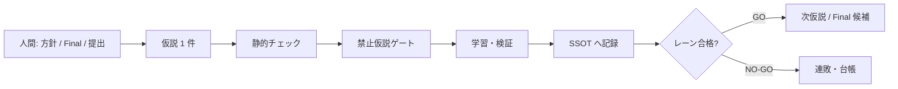

# ROGII — Wellbore Geology Prediction（Kaggle）

本リポジトリは、Kaggle Featured コンペ  
[**ROGII - Wellbore Geology Prediction**](https://www.kaggle.com/competitions/rogii-wellbore-geology-prediction)  
向けの**個人研究の公開用記録**です。課題の要約、検証の物差しの切り分け、Final 提出の意図、提出 Notebook の抜粋、および **Cursor エージェントをどうゲート付きで使ったか**をまとめています。

**エージェントとの役割分担（一句）:**  
Notebook の実装反復・実験ログの整形・ルール適用の下支えは **Cursor エージェント**で速くし、**人間は仮説の優先順位・検証レーン（Trust / Public）の設計・何を Final に残すか・Kaggle 上の提出の最終判断**に集中した。

**制約の要約:** Code Competition · 提出は Notebook · 指標は行単位 **TVT** の **RMSE**（小さいほど良い）。Public LB はテストの約 **26%**、最終順位は Private 約 **74%**。終了後まで Public だけを「最終成績の代理」にしない方針。

**最終成績（自チーム）**

| | スコア | 順位（N=6125） |
|---|---|---|
| **Private（最終）** | **9.142** | **#594 · Bronze** |
| Public（競技中の表示） | **6.190** | 約 **#143** |

**Final 2 枠（事後検証込み）**

| 枠 | 提出面 | Public | Private | 意図 |
|---|---|---:|---:|---|
| 1 | **666**（中間面＋残差ブレンド α≈0.35） | 6.509 | **9.142** | Trust 用の主軸 · **Private 最良側** |
| 2 | **farvol**（tip×thin 0.95/0.05） | **6.190** | 9.453 | Public 強め · 多様性 |

Private 公開後も **枠1（666）≻ 枠2（farvol）**。Public 頭を両枠に置かない運用と整合した。

_English :_ ROGII wellbore TVT prediction (RMSE); **lane-split Trust CV vs Public partial LB**; Final dual of residual surface **666** + Public-head **farvol**; **agent-gated** experiment loop with **human-owned** Final & submit. Private **9.142 (#594)** · Public **6.190**.

---

## CV・LB・Final — 何を信じ、何に使わないか

| 物差し | 何のスコアか | このコンペでの役割 |
|---|---|---|
| **ローカル CV（Trust）** | train 坑井を **井戸単位** で分け、評価区間の **RMSE** を測る（行ランダム KFold は採用根拠にしない） | **手法を採るか捨てるか・Final 枠1 の主判定** |
| **Public LB** | 隠れテストの約 **26%** だけの RMSE | 提出が壊れていないか／別意図（Public 強）の強さ。**Private の点推定ではない** |
| **Private LB** | 残りの約 **74%** の RMSE | **最終順位の正**（締切後に確定） |
| **診断・オラクル** | オフライン天井・pack 等 | 参考のみ。**これだけで Final / GO にしない** |

| よくある誤解 | このリポでの扱い |
|---|---|
| Public が良い＝最終でも良い | 否定。26% 固定スライスは Private と井集合が違う |
| Public が 0.05 良くなった＝確実に強い | 否定。無編集再提出でもブレがあり、**差 ≲0.08 前後はノイズ帯**として GO の主根拠にしない |
| CV は 1 種類で十分 | 否定。**速さ用と信頼用を複数持ち**、使う場面を分ける（次節） |

**666 を枠1に置いたときの考え方（一行）:**  
残差ブレンド面は Public が tip 頭より悪くても、**出荷可能な Trust CV／dual 上で候補として残せた**ものを枠1に固定。Public 悪化だけでは Trust レーンを落とさない。

詳細の方針文書: [docs/cv-final-slots.md](docs/cv-final-slots.md)

---

## CV を複数持った理由（速度 × 信頼）

**主物差しの型は固定**する: **well-Group 寄り** · 評価区間のみ · pooled RMSE。  
そのうえで、**井の本数・seed 数・実行コストだけを段階的に上げる**「CV の階層」を用意した。ねらいは、

- 壊れた仮説を **短時間で落とす**（実験回数を稼ぐ）
- 残った候補だけ **厚い CV で採否・Final を決める**（信頼性）

| 段階（例） | 井集合のイメージ | コスト感 | 使う場面 |
|---|---|---|---|
| **速い CV（T0–T1）** | hard 寄りの少数井（例: hard20）· seed 少 | 短時間 GPU / ローカル | 形式・壊れ検知 · 粗スクリーニング。**本採用の単独根拠にしない** |
| **本採用 CV（T2）** | hard + 層化した sample 等で **≈80 井級** | 数時間 GPU 帯 | graft／手法変更の **本採用判定** |
| **Final 向け CV（T3）** | T2 と同じ井集合を基本に **複数 seed** | 重い（フル再実行）か、**固定 faces 上なら短時間** | Final 枠1 候補の確定 · ノイズより改善が大きいことの確認 |
| **診断** | フル井の門番や空間監査など | 用途限定 | 楽観検出・安定幅の観測。Final 単独根拠にしない |

**2 種類の「厚い検証」を混同しない**よう運用した:

| 種別 | 中身 | 速度と信頼 |
|---|---|---|
| **A. フル tip 再実行** | 予測パイプラインを seed×N でほぼ回し直す | **遅いが信頼が厚い**（面そのものが揺れる） |
| **B. faces / residual 監査** | 既に出した固定中間面の上で α・混成などだけを変えて train 評価 | **速い**（数十秒〜数分級も）ので回数を稼げる。面が固定なので **A の完全代替ではない** |

現場では B で残差 α などを広く試し、**通過したものに限って** A や T2 級で固める、という回し方をした。  
エージェント運用（下節）とも合わせ、**1 仮説を適切な Tier の CV にだけ載せ**、重い再実行の枠を浪費しない。

**レーンとの接続**

| レーン | 主に見る物差し | 止めてよい理由 |
|---|---|---|
| **primary（Trust）** | 上記ローカル CV・dual の健全性 | Trust の acceptance 割れ · 形崩れ · 禁止仮説 |
| **public** | Public LB | その実験が Public 用であるときのみ |
| **diagnostic** | オラクル・天井 | **Final 単独にしてはいけない** |

Public の微小悪化だけで Trust レーン全体を止めない。逆も同様。

---

## 技術面のハイライト

- **課題:** 水平坑井の検層・軌道と垂直 **typewell** を対応づけ、区間ごとの **TVT**（地層の厚さに相当する量）を予測。  
- **パイプライン（1本）:** マッチング／軌跡推定 → TVT 面 → Trust 側は **残差ブレンド**、Public 側は **別系統の tip ブレンド**（意図の違う面を Final に残す）。  
- **検証の切り分け:** Trust CV（井単位・階層あり）と Public LB（約 26%）と diagnostic を **役割を固定**して混ぜない（上節）。  
- **CV 階層:** 速い少数井 → ≈80 井級の本採用 → multi-seed / faces 監査で Final。速度と信頼性を両立。  
- **提出:** Final は **2 枠**を前提に、Trust 面と Public 面を分ける（単一の Public 最強面の二重掲載を避ける）。  
- **運用:** 仮説は 1 件ずつ（CHK）、**適切な Tier の CV だけ**通す → 静的チェック → 禁止仮説ゲート → SSOT 記録。エージェントによる **competitions submit は禁止**。  
- **再現:** 提出 kernel の抜粋を `notebooks/` に置く。コンペ**データ本体は同梱しない**。

詳細: [docs/approach.md](docs/approach.md) · [docs/cv-final-slots.md](docs/cv-final-slots.md) · [results/leaderboard-summary.md](results/leaderboard-summary.md)

---

## 不確実性の下での実験

**原則**

1. **CV ≠ Public LB。** Public は複数シグナルのひとつであり、Private の点数推定ではない。  
2. **最終順位は Private。** 競技中に見える順位だけを最適化ゴールにしない。  
3. **Public の小さな差（ノイズ帯）を「改善の確定」に使わない。** 採用・打ち切りは Trust 側の acceptance を優先する。  
4. **オフラインの天井・診断スコアは GO の主根拠にしない。** 出荷できる面だけを Final 候補にする。  
5. **CV は一枚岩にしない。** 速い CV で回数を稼ぎ、厚い CV で採用する（前節）。

**このリポジトリでのストーリー（観測 → 仮説 → 打ち手 → 学び）**

- **観測:** tip／薄いブレンド系は **Public で強く**見える一方、残差・中間面系は Public が悪くても **Private で相対的に耐える**ケースがあった。Public≈26% というホスト公表と整合する揺れが起きた。  
- **仮説:** Public 一点最適は shake-up で痛い。Final は **信頼できる物差しの面**と **別意図の Public 面**をセットで持つべき。スクリーニングと本採用で **CV コストを分けない**と枠が足りない。  
- **打ち手:**  
  - レーンを **primary（Trust）/ public / diagnostic** に分離  
  - **CV 階層（速い／本採用／Final）** を決め、仮説ごとに載せる段を明示  
  - Trust 採用面として **666（残差 α≈0.35）** を維持（Public 悪化だけでは落とさない）  
  - 枠2は **farvol** で Public と多様性を担保  
  - 後段 dual が通らない L 再学習梯子などは **NO-GO のまま載せず打切り**  
- **学び:** 「Public で一番良い提出を2回選ぶ」より、「物差しと意図を分けた 2 枠」と「CV の階層化」の方が、終了後も説明が残る。失敗は禁止台帳・教訓に残し、同じ型の空回りと **重い CV の無駄撃ち**を止める。

---

## AI エージェントの使い方（このリポジトリ）

**ツール名より運用**を残す。エージェントは高速な実行役で、権限の境界は文書化する。  
**Skills / Rules / ゲート用スクリプトは本リポジトリ内に同梱**している（別コンペ用レポへの委譲ではない）。

| 項目 | 内容 |
|---|---|
| **目的** | 実装・検証・ログ整形を速くし、**実験の型（1 仮説・レーン・SSOT）を崩さない**こと。 |
| **入力（例）** | コンペ制約の要約、`exp` の SSOT（Best / 次アクション）、checklist の 1 仮説、[静的チェック](.cursor/skills/kaggle-static-check/SKILL.md)／[禁止仮説ゲート](.cursor/skills/_shared/EXPERIMENT-ID-NAMESPACES.md) の規則。 |
| **出力（例）** | Notebook／スクリプト差分、run ログ、ハイパラ表・checklist の更新案、短い失敗理由。 |
| **人間のゲート** | **方針とレーン設計**、長時間 GPU／Kaggle 実行の許可、**Final 2 枠の選定**、**提出の実行**、Rules・データ取得の確認。 |
| **エージェントに任せない例** | 本番提出のクリック／CLI 提出、Public 小差だけでの Trust 全体停止、データ規約を無視した再配布。 |

**再現可能に残す習慣:** プロンプト全文の羅列ではなく、**判断とゲート**を Markdown に残す（[`docs/`](docs/) · 実験 index · 禁止台帳）。Skill / Rule / 共有 SSOT は下表のパスから辿れる。

| レイヤ | このフォルダでの場所 | 何があるか |
|---|---|---|
| **Skills 索引** | [`.cursor/skills/README.md`](.cursor/skills/README.md) | 配置ポリシー · 全 Skill の入口 |
| **代表 Skill** | [kaggle-experiment-checklist](.cursor/skills/kaggle-experiment-checklist/SKILL.md) · [kaggle-static-check](.cursor/skills/kaggle-static-check/SKILL.md) · [kaggle-lanes-final-strategy](.cursor/skills/kaggle-lanes-final-strategy/SKILL.md) · [kaggle-cv-design](.cursor/skills/kaggle-cv-design/SKILL.md) · [kaggle-pretrain-gate](.cursor/skills/kaggle-pretrain-gate/SKILL.md) · [kaggle-submission-validator](.cursor/skills/kaggle-submission-validator/SKILL.md) | 仮説ループ · 静的検査 · レーン/Final · CV · 学習前 · 提出前 |
| **共有 SSOT** | [`.cursor/skills/_shared/`](.cursor/skills/_shared/) | 例: [DECISION-FLOW](.cursor/skills/_shared/DECISION-FLOW.md) · [LANES-AND-FINAL-SLOTS](.cursor/skills/_shared/LANES-AND-FINAL-SLOTS.md) · [CV-DESIGN](.cursor/skills/_shared/CV-DESIGN.md) · [STATIC-CHECKS](.cursor/skills/_shared/STATIC-CHECKS.md) · [NOTEBOOK-LINKED-SUBMIT](.cursor/skills/_shared/NOTEBOOK-LINKED-SUBMIT.md) |
| **Rules（常時）** | [`.cursor/rules/`](.cursor/rules/) | 例: [kaggle-decision-gates](.cursor/rules/kaggle-decision-gates.mdc) · [kaggle-public-lb-bias-stop](.cursor/rules/kaggle-public-lb-bias-stop.mdc) · [kaggle-hypothesis-ban-ledger](.cursor/rules/kaggle-hypothesis-ban-ledger.mdc) · [kaggle-three-gates](.cursor/rules/kaggle-three-gates.mdc) |
| **機械ゲート** | [`scripts/run-static-checks.ps1`](scripts/run-static-checks.ps1) · [`scripts/run-hypothesis-ban-gate.ps1`](scripts/run-hypothesis-ban-gate.ps1) · [`scripts/check-staged-secrets.ps1`](scripts/check-staged-secrets.ps1) · [`scripts/validate-submission.ps1`](scripts/validate-submission.ps1) | Agent が本実験前／commit 前／提出前に通す CLI |

概念図:



概念の文章化: [docs/agent-system.md](docs/agent-system.md)  
運用地図（厚い・当時の Agent 向け）: [AGENTS.md](AGENTS.md)

---

## このリポジトリについて

公開用に**作業キャッシュと WIP を削除した**記録です。  
**提出 Notebook 抜粋・判断文書・Cursor Skills / Rules / ゲート scripts· コンペ時の docs-ja/docs-en・実験 SSOT** を同じツリーに置きます。

| 読み方 | 場所 |
|---|---|
| 入口 | 本 [README.md](README.md) |
| 薄い写経 | [`docs/`](docs/) · [`notebooks/`](notebooks/) · [`results/`](results/) |
| エージェント実装 | [`.cursor/skills/`](.cursor/skills/) · [`.cursor/rules/`](.cursor/rules/) · [`scripts/`](scripts/) |
| コンペ時ドキュメント | [`20260722-rogii-wellbore/docs-ja/`](20260722-rogii-wellbore/docs-ja/) · [`docs-en/`](20260722-rogii-wellbore/docs-en/)（**原文のまま**） |
| 実験 index 等 | [`20260722-rogii-wellbore/exp/`](20260722-rogii-wellbore/exp/)（`work/` キャッシュは削除） |
| 終了後振り返り | [`20260722-rogii-wellbore/retro/`](20260722-rogii-wellbore/retro/) |

全履歴・巨大生成物の復元は **Private アーカイブ**を正とする。横断 knowledge-store は含めない。整理ログ: [PORTFOLIO-CLEANUP-LOG.md](PORTFOLIO-CLEANUP-LOG.md)

---

## メモ

- **スコアの正:** [results/leaderboard-summary.md](results/leaderboard-summary.md) · 詳細は `exp/exp-index.md` / `retro/`。  
- **コンペデータは含まない。** Data タブから各自取得。  
- **`.cursor/` と `scripts/` は公開対象。** 秘密情報は置かない。  
- **他者解法コード全文は含めない**（分析メモは docs-ja 等）。  
- **ライセンス:** [LICENSE](LICENSE)（MIT · 自作部分）。コンペデータ・他者成果物には別条。

---

## 実験ワークフロー

```
1. 制約・レーン・Final 本数を宣言（Overview を正）
2. 仮説ごとに **載せる CV 段階（速い / 本採用 / Final）** を決め、checklist に 1 件
3. 静的チェック → 禁止ゲート → その段階の CV だけ実行
4. SSOT（Best / 次アクション / ハイパラ表）を更新
5. Final 候補は意図の違う面を組み合わせ、人間が提出
6. 終了後: Private で枠選択を突合し、教訓を残す
```

---

## ディレクトリ構成

```text
.
├─ README.md · LICENSE
├─ docs/                     # 公開用の短い写経（JA 中心）
├─ notebooks/                # Final 2 枠の提出 Notebook
├─ results/
├─ .cursor/skills|rules|agents/
├─ scripts/
├─ AGENTS.md                 # 当時の Agent 向け地図（厚い）
└─ 20260722-rogii-wellbore/  # コンペ ROOT（公開用に整理済み）
   ├─ docs-ja/ · docs-en/    # 当時ドキュメント（言語フォルダごと残置）
   ├─ exp/                   # SSOT md · checklist · failures（work は空プレースホルダ）
   ├─ retro/                 # retro-*.md（archive 削除）
   ├─ my-submitted-notebook/ # Final 2 のみ
   └─ dataset/               # README のみ（データ本体なし）
```

WIP（`my-notebook` 等）・他者 NB 全文・`exp/work` 実体は **削除済み**（プレースホルダ README のみ）。

---

## 主要ファイル

| 場所 | 役割 |
|---|---|
| [README.md](README.md) | 方針・結果・agent 運用の要約 |
| [LICENSE](LICENSE) | MIT |
| [AGENTS.md](AGENTS.md) | コンペ制約・フォルダ規約・Agent 禁止事項（詳細） |
| [docs/problem-and-metric.md](docs/problem-and-metric.md) | 課題と指標 |
| [docs/approach.md](docs/approach.md) | 解法の一本線 |
| [docs/cv-final-slots.md](docs/cv-final-slots.md) | CV 階層 · レーン · Final · 速度と信頼 |
| [docs/agent-system.md](docs/agent-system.md) | エージェント制御面の説明 |
| [docs/lessons.md](docs/lessons.md) | 持ち出せる学び |
| [notebooks/final-trust-666/](notebooks/final-trust-666/) | 提出 Notebook（Trust） |
| [notebooks/final-public-farvol/](notebooks/final-public-farvol/) | 提出 Notebook（Public） |
| [results/leaderboard-summary.md](results/leaderboard-summary.md) | 数字表 |
| [20260722-rogii-wellbore/docs-ja/](20260722-rogii-wellbore/docs-ja/) | 当時の日本語 docs（CV・戦略等） |
| [20260722-rogii-wellbore/docs-en/](20260722-rogii-wellbore/docs-en/) | 当時の英語 / Discussion 原文メモ |
| [20260722-rogii-wellbore/exp/exp-index.md](20260722-rogii-wellbore/exp/exp-index.md) | 実験 SSOT |
| [20260722-rogii-wellbore/retro/retro-private.md](20260722-rogii-wellbore/retro/retro-private.md) | Private 振り返り |
| [`.cursor/skills/README.md`](.cursor/skills/README.md) | Skills 配置の入口 |
| [`.cursor/skills/kaggle-experiment-checklist/SKILL.md`](.cursor/skills/kaggle-experiment-checklist/SKILL.md) | 仮説検証ループ |
| [`.cursor/skills/kaggle-static-check/SKILL.md`](.cursor/skills/kaggle-static-check/SKILL.md) | 本実験前の静的検査 |
| [`.cursor/skills/_shared/DECISION-FLOW.md`](.cursor/skills/_shared/DECISION-FLOW.md) | 判断ゲートの地図 |
| [`.cursor/rules/kaggle-decision-gates.mdc`](.cursor/rules/kaggle-decision-gates.mdc) | 常時ゲート要約 |
| [`scripts/run-static-checks.ps1`](scripts/run-static-checks.ps1) | 静的チェック CLI |

---

## データセット（リポジトリには含めない）

- **公式:** [コンペ Data](https://www.kaggle.com/competitions/rogii-wellbore-geology-prediction/data)  
- ローカル `dataset/` は置いても Git 除外。再現時は各自ダウンロード。

---

## 参考文献・リンク

- コンペ: [ROGII - Wellbore Geology Prediction](https://www.kaggle.com/competitions/rogii-wellbore-geology-prediction)  
- 本リポジトリ（公開ポートフォリオ）: [neko-rr/kaggle-rogii-wellbore-portfolio](https://github.com/neko-rr/kaggle-rogii-wellbore-portfolio)  
- 本リポ内の運用実体: [`.cursor/skills/`](.cursor/skills/) · [`.cursor/rules/`](.cursor/rules/) · [`scripts/`](scripts/)  
- Private 全史（復旧用・非公開）: [`neko-rr/kaggle-rogii-wellbore-geology-prediction`](https://github.com/neko-rr/kaggle-rogii-wellbore-geology-prediction)

---

*数字 → なぜその枠か → エージェント込みの進め方（同梱 Skills）、の順で読むと全体がつながります。*
