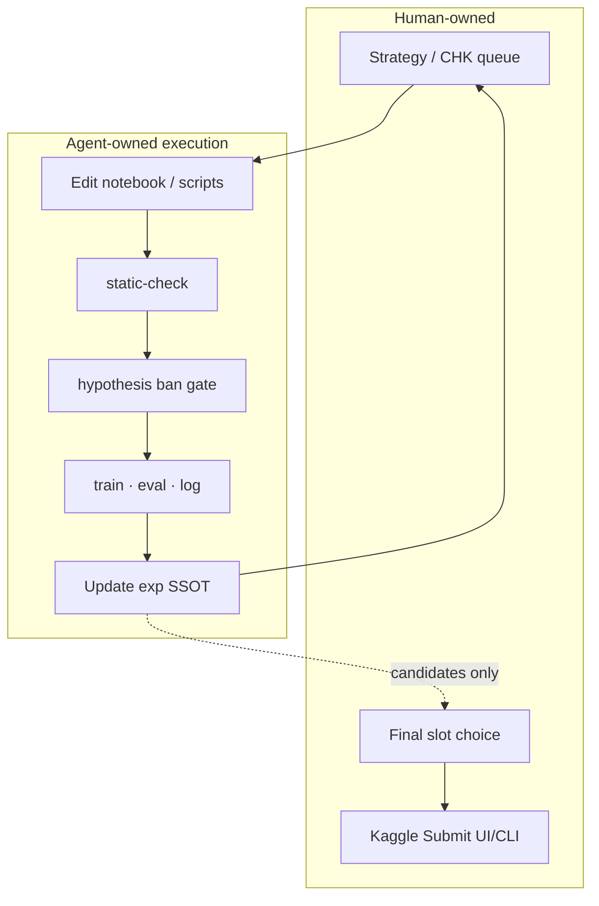

# Agent-assisted competition system

## Why this section exists

Many applicants say “I used AI.”  
This portfolio documents a **system design**: machines accelerate execution; **humans keep strategy, Final, submit, and ethical boundaries.**

Implementation lived as Cursor rules / skills / PowerShell gates in this workspace (template-driven across contests).  
The important part for employers is the **control plane**, not every file name.

## Goals

1. Make **one hypothesis per loop** (prevent thrashing).  
2. Stop wasting GPU / Kaggle quota on broken code or dead ideas.  
3. Keep records **single-sourced** (Best / next action not copy-pasted into five docs).  
4. Separate **Trust vs Public** decisions mechanically.  
5. Never let the agent submit to the competition.

## Control plane

### SSOT (single source of truth)

- One index for Best / main artifact / next action.  
- Hyperparameter and submission tables live in dedicated files.  
- Checklist is a **hypothesis queue**, not a story rewrite of the leaderboard every day.

### Experiment types (T0–T4)

| Type | Meaning |
|---|---|
| T0 | New baseline |
| T1 | External artifact adoption |
| T2 | Blend / stacking style |
| T3 | Own retrain / redesign |
| T4 | Survey / screen only |

Repeated **NO-GO of the same type** forces a type switch (anti thrash).

### Static gate

Before long training: syntax, notebook integrity, private asset flags, ruff-class lint.  
**FAIL → no train.** Editor extensions are not a substitute.

### Hypothesis ban ledger

When an abstract idea is *structurally* dead, record keywords and stop near-duplicate sweeps.  
Learned lessons use a **different ID family** from bans (so “failure IDs” never mean “insights”).

### Lanes

Every CHK declares `primary | public | diagnostic`.  
Agent (and human) must not stop Trust work because Public ticked up by noise.

### Submit boundary

Documented runbooks allow agent to **prep** kernels; **submit is always user**.  
Also keeps API keys out of agent-authored commits.

### Knowledge isolation

Cross-competition lessons go to a **private knowledge store** after audit (not shipped in the public portfolio tree).  
**Skills / Rules / gate scripts for this competition live in-repo** — see the root [README](../README.md) paths under `.cursor/skills/`, `.cursor/rules/`, and `scripts/`.

## What this bought in ROGII

- High experiment throughput without losing the Final story.  
- Explicit stop when residual dual / L retrain ladders failed.  
- Post-comp writeups still reconstructable (private archive) because logs were mandatory.

## What this is *not*

- Not unattended “fully autonomous Kaggle.”  
- Not an excuse to skip domain reasoning (geosteering / TVT / Public 26%).  
- Not a dump of every prompt.

## 要約

> LLM エージェントは **SOP とゲートの裏で動く実行役** とみなす。  
> 目的は、部分公開リーダーボード下でも再現できる判断品質（薄い MLOps に近い）。
